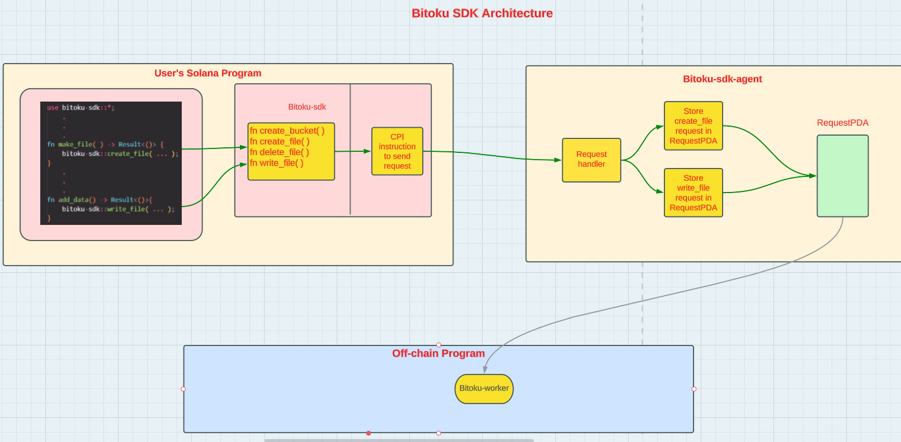

<H1>Bitoku-User-Sample</H1>

Bitoku is a blockchain-based storage layer for Solana programs.

The overall architecture is depicted in this diagram:

This repo contains Bitoku-User-Sample, one of the four components of the Bitoku SDK.
